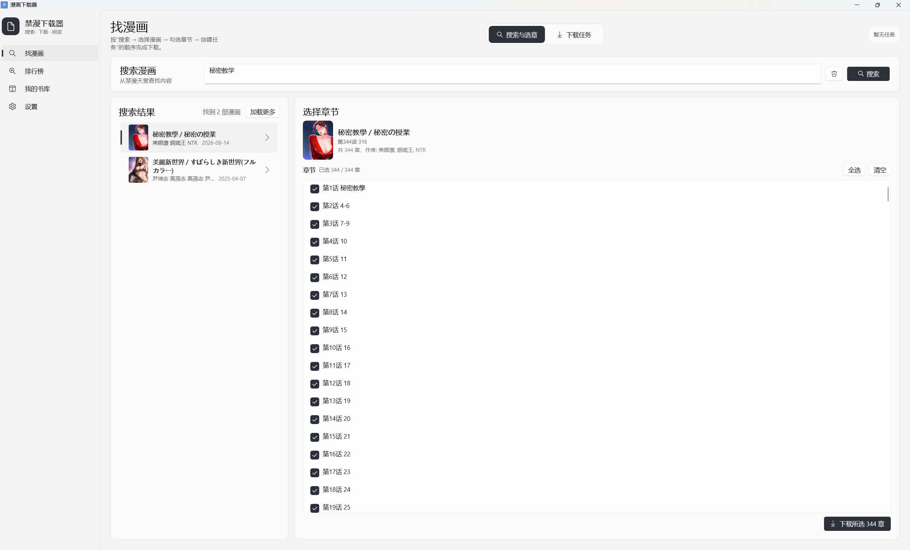

# 漫画下载器

> **v2.2.0 已发布！** [下载安装包](https://github.com/Leisurely-Cloud/Comic/releases/latest) — 单文件安装，无需额外依赖。



## 功能特性

- **多站点支持** — 包子漫画、MangaCopy、漫画柜等
- **排行榜浏览** — 按站点和分类浏览热门漫画排行榜
- **批量下载** — 选择多个章节一键下载
- **CBZ 导出** — 将下载的漫画导出为 CBZ 格式，实时显示导出进度
- **本地书库** — 浏览和管理已下载的漫画
- **内置阅读器** — 直接在应用内阅读已下载的漫画
- **下载控制** — 支持暂停、继续、停止，实时显示下载进度
- **搜索历史** — 快速访问之前的搜索记录
- **代理支持** — 可配置 HTTP 代理访问受限站点
- **现代化界面** — 原生 WinUI 3 桌面应用，支持明暗主题

## 项目结构

```
app/
├── frontend-winui/    # WinUI 3 桌面客户端 (C#, .NET 9, MVVM)
└── backend/           # 本地 HTTP API (Python)
```

- WinUI 客户端通过 REST API 与后端通信，地址 `http://127.0.0.1:18765/`
- 客户端可自动启动/停止后端进程
- 下载进度通过 SSE (Server-Sent Events) 实时推送

## 快速开始

### 方式一：下载安装包（推荐）

从 [Releases](https://github.com/Leisurely-Cloud/Comic/releases/latest) 下载 `ComicDownloader-2.2.0-Setup.exe`，双击安装即可，无需额外依赖。

### 方式二：源码运行

**环境要求：**
- Windows 10/11
- .NET 9 SDK
- Python 3.10+

**一键启动：**

```bat
start-winui.cmd
```

**手动运行：**

```powershell
# 后端
.\.venv\Scripts\python.exe .\app\backend\run_backend.py

# 前端
dotnet build .\app\frontend-winui\src\Comic.WinUI\Comic.WinUI.csproj
```

**下载存储位置：** `%USERPROFILE%\Downloads\ComicDownloads`（可通过环境变量 `COMIC_DOWNLOAD_DIR` 自定义）

## 测试

```powershell
.\.venv\Scripts\python.exe -m unittest discover -s .\app\backend\tests -v
```

## 构建安装包

**环境要求：**
- .NET 9 SDK
- [Inno Setup 6](https://jrsoftware.org/isinfo.php)

**构建：**

```bat
build-installer.bat
```

输出：`installer-output/ComicDownloader-2.2.0-Setup.exe`

## 技术栈

| 组件 | 技术 |
|------|------|
| 前端 | WinUI 3, C# 12, .NET 9, CommunityToolkit.Mvvm |
| 后端 | Python 3.10+, 标准库 http.server |
| 通信 | REST API + SSE |
| 打包 | 自包含，非打包部署（无 MSIX） |

## 许可证

[MIT](./LICENSE)
